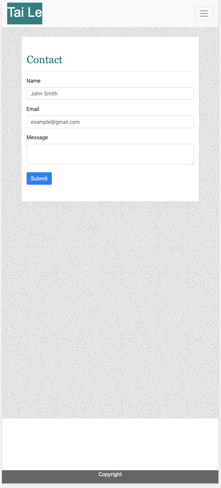

# responsive-portfolio

## Summary
This page was designed with a responsive layout with a navbar. The navbar is used to navigate to other html such as portfolio and contacts information. 

## Techonologies Used
- Bootstrap - used to create components in a faster pace.
- CSS - used to style the layout of the page.
- GitHub - used to push and commit the page.


## Site Pictures




## Code Snippet
```html
<header>
        <nav class="navbar navbar-expand-lg navbar-light bg-light">
            <a class="navbar-brand" href="#">
                <h1>Tai Le</h1>
            </a>
            <button class="navbar-toggler" type="button" data-toggle="collapse" data-target="#navbarSupportedContent"
                aria-controls="navbarSupportedContent" aria-expanded="false" aria-label="Toggle navigation">
                <span class="navbar-toggler-icon"></span>
            </button>

            <div class="collapse navbar-collapse" id="navbarSupportedContent">
                <ul class="navbar-nav ml-auto">
                    <li class="nav-item">
                        <a class="nav-link" href="index.html">About <span class="sr-only">(current)</span></a>
                    </li>
                    <li class="nav-item">
                        <a class="nav-link" href="portfolio.html">Portfolio</a>
                    </li>
                    <li class="nav-item">
                        <a class="nav-link" href="contact.html">Contact</a>
                    </li>
                </ul>
            </div>
        </nav>
    </header>
```
This code is a navbar from bootstrap which made designing the header much faster.

## Author Links
[LinkedIn](www.linkedin.com/in/tu-tai-le-2a9646139)
[GitHub](https://github.com/TaiLe96)